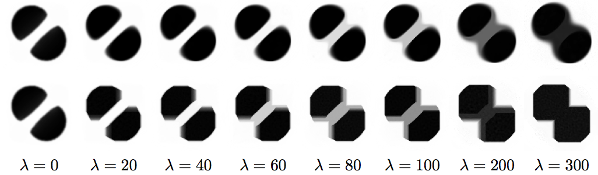

This toolbox reproduces the numerical results of the paper:

M. Cuturi, G. Peyré. [A Smoothed Dual Approach for Variational Wasserstein Problems](http://arxiv.org/abs/1503.02533). SIAM Journal on Imaging Sciences, 9(1), pp. 320–343, 2016.

----------
Content

These code reproduces the experiments on the TV regularization:
* test_shapes.m: barycenters of images with regularization.
* test_gradflow.m: same but for gradient flows instead of barycenters.
* test_meg.m: barycenters for MEG data, i.e. defined on a graph.

These codes are
* compute_tv_barycenters.m: main function to compute regularized barycenter using FB or BFGS.
* compute_barycenter_grad.m: compute the gradient of the dual cost function for barycenters.
* compute_dual_wasserstein.m: compute the gradient of the dual Wasserstein distance.

----------
Copyright (c) 2015 Gabriel Peyré
